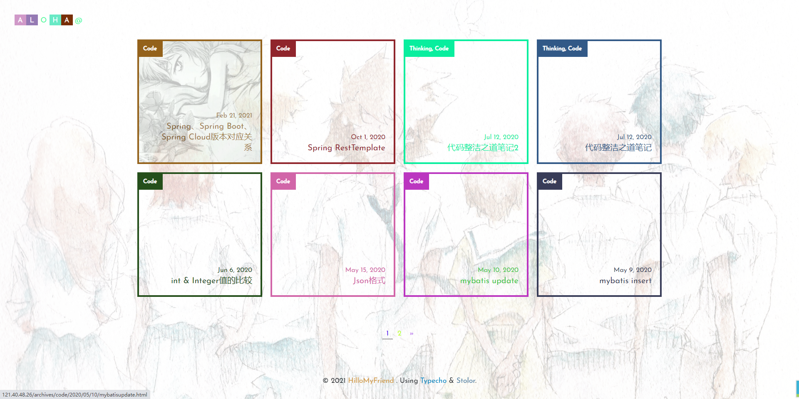

## Stolor

Story & color  故事 + 颜色

My Bolg: [HilloMyFriend](https://vrainstorm.link).

### 预览图



### 主题的一些食用说明(绝大部分摘自原作者)

#### config.php

```
// on: 开启
// off&其他: 关闭

// 默认显示文章导航树
$GLOBALS['isTorTree'] = 'off';

// 自动设置导航栏中 margin 及 width 值（推荐开启）
$GLOBALS['isAutoNav'] = 'on';

// 将导航栏中的 1, 2, 3 替换成 Emoji 图标
$GLOBALS['isIconNav'] = 'off';

// 在菜单栏中加入 RSS 按钮
$GLOBALS['isRSS'] = 'off';

// 初始卡片色为异色
$GLOBALS['isDiffColorCard'] = 'off';

// 背景图设置. 填入图片 URL 地址，留空为关闭
// $GLOBALS['style_BG'] = '';

// 背景图片不透明度
$GLOBALS['style_BG_opacity'] = 0.24;

// 卡片背景图片不透明度
$GLOBALS['style_card_opacity'] = 0.77;

```

#### 菜单

标题旁边有一个 · 字符, 点击后便可显示菜单.**1**, **2**, **3** 分别代表 **独立页面菜单**、**导航树**(仅在文章界面有用, 仅解析 h3, h4 标签)以及**搜索框**.

若您觉得 1, 2, 3 太抽象, 可以将 `config.php` 中 `$GLOBALS['isIconNav']` 设置为 `on` 即可替换成相应 Emoji 图标.

#### 网站标题修改

本主题要修改标题必须自行修改代码... 位于 `header.php` 的 `class .header-logo` , 用 `<span class="b"></span>` 及 `<span class="w"></span>` 把自已的站点标题拼接出来就行了, 其他可以不做修改.

#### 修改网站标题后菜单定位

您可以将 `config.php` 中 `$GLOBALS['isAutoNav']` 设置为 `on` 即可自动调整, 无需进行以下操作.

若您网站标题字数与原来(5个英文字母)不同, 那要自行修改菜单的 `margin` 值.位于 `assert/css/main.css` 的 `#menu-page` 及 `#search-box` , 每个字符格子宽度为 28px , 可自行计算（别忘了算上菜单格, 有4个）.

#### 背景图设置

若要设置背景图, 请修改位于 `config.php` 的 `$GLOBALS['style_BG']` 变量值.改为图片链接即可, 留空即为关闭.

#### 背景图灰度设置

若要设置背景图灰度, 请修改位于 `assert` -> `css` -> `main.css`下的 `body:before` 的 `xxx-filter & filter` 属性.

#### 卡片图灰度设置

若要设置背景图灰度, 请修改位于 `assert` -> `css` -> `main.css`下的 `.post-list>li .cover` 的 `xxx-filter & filter` 属性.

#### 导航树

若要默认显示导航树, 请修改位于 `config.php` 的 `$GLOBALS['isTorTree']` 变量值.

若要手动控制, 请于 `文章编辑页面-自定义字段` , 添加 `tor` 字符, 并设置为 `on` 或者 `off` .

注意, 导航树仅解析 h3, h4 标签, 并且当页面宽度小于 1024px, 导航树将不再显示.

#### 文章封面图

可为各文章单独设置封面图(显示在方格中).

请于 `文章编辑页面-自定义字段` , 添加 `cover` 字符, 并设置为相应图片的链接.

#### 友链模板

请参考 [PR: 增加友链模板 #30](https://github.com/txperl/Story-for-Typecho/pull/30).

### 写在最后

#### 感谢

本主题基于 [森の色/Yumoe](https://yumoe.com/): [story](https://github.com/txperl/Story-for-Typecho) by [Trii Hsia](https://github.com/txperl), 感谢原作者做出这么棒的主题!!!

祝大家食用愉快 ~ ~
